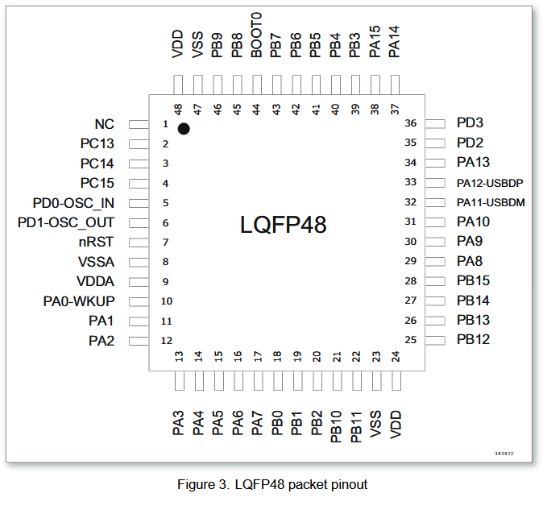

# Repurposing a Eurorack Module

I have a neglected Cre8audio Cellz module that I haven't used for a while. I am a bit interested in it, because it is a MCU that is already setup to handle eurorack voltages, with a capacitive touch interface with lights and a few inputs and outputs.

## Breakdown

I wanted to take a look inside, which requires removing the mount screws on the ports and knobs. It also requires breaking/removing the glue on a few pieces of foam which act as separators. The module breaks down into two components. The top board has the lighting and touch panel. The bottom has buttons, ports, knobs and a the MCU.

The MCU is a MM32L MCU, which seems to be a MindMotion low power series mcu. The exact model is something like MM32L34 (obscured a bit by a scratch), but it seems to line up with the pin out for a LQFP48 controller.  The USB traces line up with the expected pins 32 and 33, which is a good sign. The oscillator also goes to pin 5 and 6. The datasheets for some close MCUS are from [mindmotion.com](https://www.mindmotion.com.cn/en/products/mm32mcu/low_power/mm32l_low_power/mm32l0xxn/). Unfortantely a lot of the application notes are only in Chinese, but there is an SWDIO interface, and the memory map is listed in the datasheet.



On the front panel, there are a few I2C debug ports. I assume that the touch panel controller is hidden underneath the lights, but is some I2C controlled capacitive sensor. The 16 lights have 8 pins. Glancing at the PCB this is probably a matrix layout, with each LED enabled by setting one GPIO low and another high.

## Front Panel

The Leds are controlled in a matrix configuration with 4 rows and 4 columns. The resistors on the main board are 10kΩ. I confirmed the layout just by connecting each combination to high and low. To light the top LED, pin 1 is pulled high, and pin 5 is pulled low. To light the next one over, pin 6 is pulled low.

Next is figuring out what type of touch sensor is used for the front touch sensor. There's a few ways to get this data out. The easiest and most flexible is an oscilloscope, but I only have an analog one with one probe, which won't get me all that far. For my first attempt, I used a microcontroller set as a I2C sensor to sniff the data is set at startup. I may move to an FPGA sniffer, if the I2C is faster than I expect.

I started with a very naive approach. Because the I2C is already designed to go through headers, it can't be too high speed, so hopefully I can use some builtin functions to get an idea of the frequency. To check that I can pick up data I wrote a simple program using built-in arduino functions, this is running on a SAMD21 at 25MHz.

```c++
#define SAMPLE_SIZE 4096

int buffer[SAMPLE_SIZE][2];

#define CLK_PIN 7
#define DAT_PIN 9

void setup() {
  // put your setup code here, to run once:
  pinMode(CLK_PIN, INPUT);
  pinMode(DAT_PIN, INPUT);

  Serial.begin(115200);
}

void detect_start(){
  while (digitalRead(CLK_PIN) != 0){

  }
}

void sample(int d){
  // Simple read
  for (int i = 0; i < SAMPLE_SIZE; i++){
    buffer[i][0] = digitalRead(CLK_PIN);
    buffer[i][1] = digitalRead(DAT_PIN);
    delay(d);
  }
}

void display(){
  Serial.println("Result:");
  for (int i = 0; i < SAMPLE_SIZE; i++){
    Serial.print("Clk: ");
    Serial.print(buffer[i][0]);
    Serial.print(", Dat: ");
    Serial.println(buffer[i][1]);
  }
}

void loop() {
  // Wait for clock to start
  detect_start();

  // Get values
  sample();

  // Print the data out
  display();

  while true{
    ;
  }
}
```

Doing some continuity testing with the labeled test points

| Pin 1 - 5V      | Pin 2 - Unknown | Pin 3 - GND |
| --------------- | --------------- | ----------- |
| Pin 4 - Unknown | Pin 5 - SDA     | Pin 6 - SCL |

Pin 2 and 4 are likely interrupts or gpio pins.
